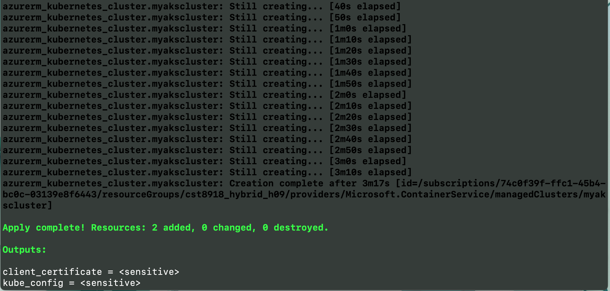
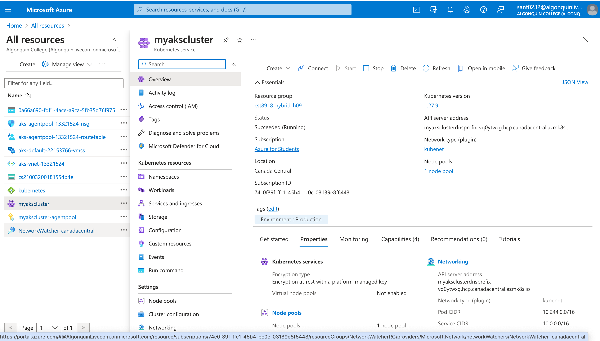
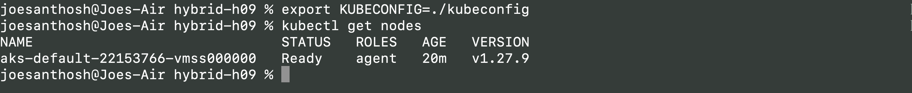
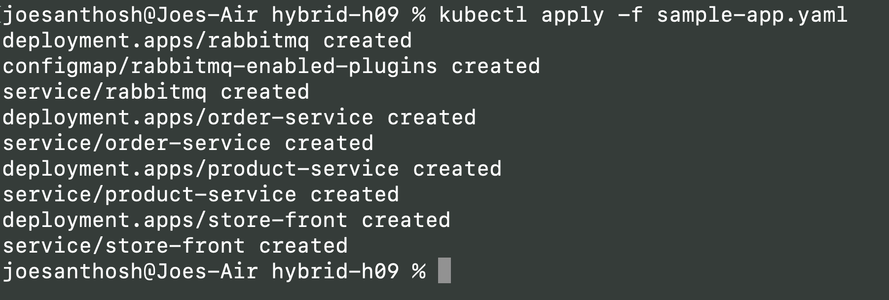

# CST8919 Hybrid 09

## Use Terraform to create an Azure Kubernetes Service (AKS) cluster
- Deployment successful

- Cluster is in Azure Portal

- Able to connect to the aks cluster

## Deploy Sample App to the AKS Cluster
