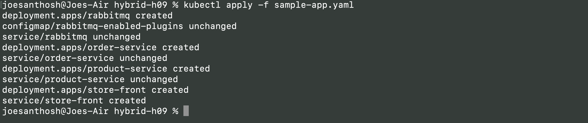
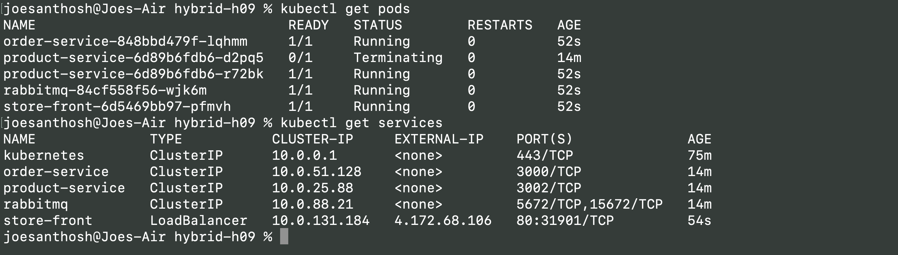
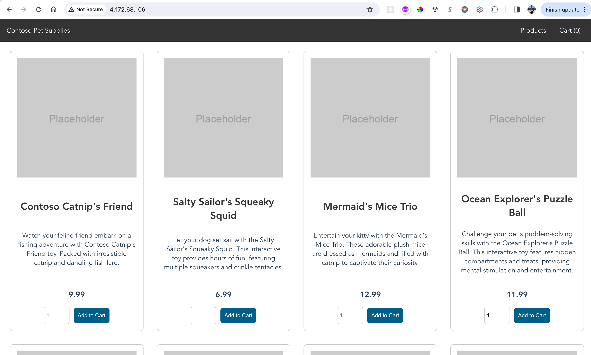

# CST8919 Hybrid 09

## Use Terraform to create an Azure Kubernetes Service (AKS) cluster
- Deployment successful

- Cluster is in Azure Portal

- Able to connect to the aks cluster

## Deploy a sample application to the AKS cluster.
- Deployed app to cluster (Deleted and re-did it to show screenshot because I cleared terminal after first deploy)

- Verify app is running

- Verify in browser that application is running using the external ip of store-front service

